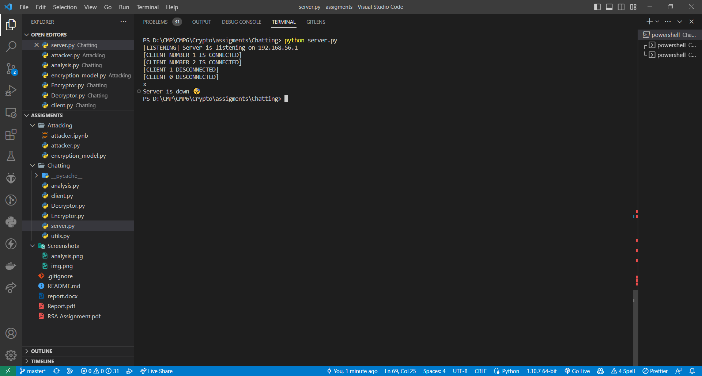

<div align= >

#  RSA (Rivest–Shamir–Adleman)

<div align="center">
   
   </div>

## About
> RSA (Rivest–Shamir–Adleman) is a public-key cryptosystem that is widely used for secure data
transmission.

## Getting Started
> This is a list of needed instructions to run chatting and attacking programs.

## Chatting Module
### Running
1. **_Open Chatting directory_**

2. **_Start the server_**
```sh
python server.py
```

3. **_Start the first client_**
```sh
python client.py
```

4. **_Start the second client_**
```sh
python client.py
```

### Screenshots


<hr />



<hr />


<hr />


## Attacking Module
### Running
1. **_Open Attacking directory_**

2. **_Run the attacker_**
```sh
python attacker.py
```

### Screenshots


<hr />


